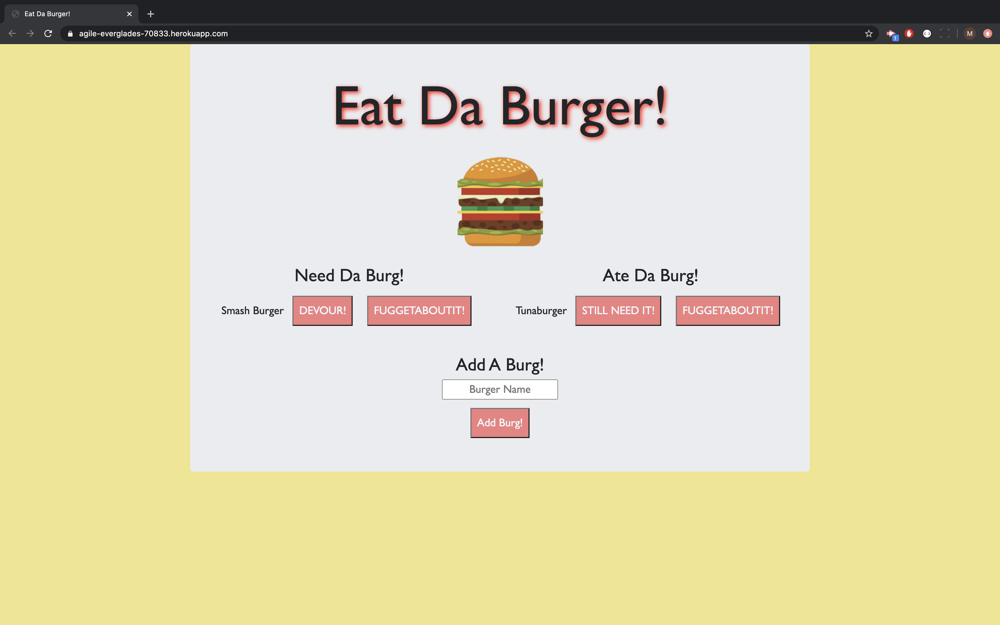
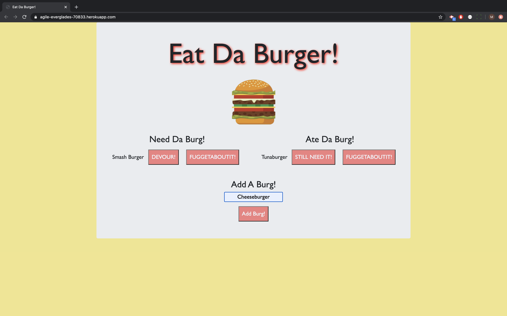
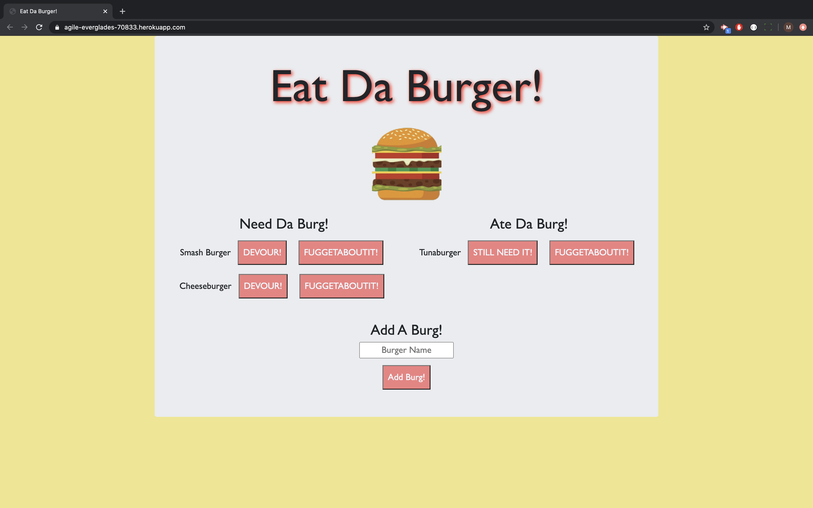

# Eat Da Burger

# **Project Description**
For this project I built an application using MYSQL to keep track of burgers that need to be eaten. You can add a burger to the database that will display in the Need Da Burg section. You can also change its status to devoured which will then display in the Ate Da Burg section. You can also delete the burger from the database.

# **Live Link**
[Heroku](https://agile-everglades-70833.herokuapp.com/)

# **Screencaps:**
  

   

  

# **Demo Video:**
[https://drive.google.com/file/d/1VO52mQUPWx5ogTRjguEUxOVau_boPYm3/view]

# **Installation**
Download the zip file and unzip it. Open the files and run npm install to intall the required dependencies. Then run npm start and navigate to your local host. Alternatively you can use the app in browser on the deployed Heroku page listed above.

# **Technology Stack**
* MySQL
* JavaScript
* Node
* Handlebars
* Express

# **Contact**
* ### **Name:**  Morgan Splawn
* ### **Github:**  [@msplawn](https://github.com/msplawn)
* ### **Email:**  [mmsplawn@gmail.com](msplawn@gmail.com)
* ### **LinkedIn:**  [https://www.linkedin.com/in/morgan-splawn-72979a1a9/](https://www.linkedin.com/in/morgan-splawn-72979a1a9/)
